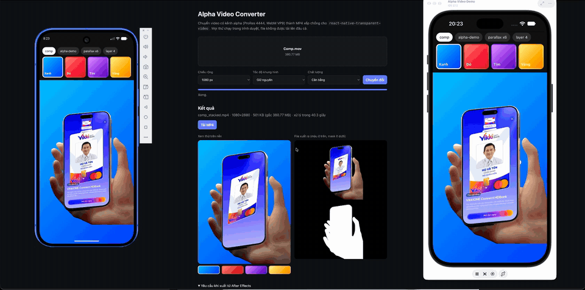

# Alpha Video Demo — react-native-transparent-video

Demo kiểm tra khả năng phát **video trong suốt (alpha)** trên React Native, chạy song song
trên iOS và Android. Repo này là bản fork của
[status-im/react-native-transparent-video](https://github.com/status-im/react-native-transparent-video),
bổ sung một app demo React Native 0.87 trong thư mục [`demo/`](demo).



Bản quay đầy đủ: [docs/demo.mp4](docs/demo.mp4)

## Chạy demo

```sh
git clone https://github.com/hieutran0413/react-native-transparent-video.git
cd react-native-transparent-video
```

Rồi chọn nền tảng:

```sh
./run-demo.sh ios
```

```sh
./run-demo.sh android
```

Script tự cài `node_modules`, chạy `pod install` (iOS), build, cài app lên máy ảo và mở
Metro. Lần build đầu mất vài phút.

### Yêu cầu

| | |
| --- | --- |
| Chung | Node >= 22.11 |
| iOS | macOS, Xcode, CocoaPods, một iOS Simulator |
| Android | Android SDK, JDK 17 (`JAVA_HOME`), một emulator đã tạo sẵn |

`ANDROID_HOME` mặc định là `~/Library/Android/sdk` nếu chưa đặt.

### Gặp lỗi?

- **Android báo `Unable to load script`**: Android 17 (API 37) chặn app debug kết nối Metro
  cho tới khi được cấp quyền local network. `run-demo.sh` đã tự cấp quyền; nếu vẫn lỗi, bấm
  **RELOAD** trong app.
- **Cổng 8081 đang bận**: đã có Metro chạy sẵn. Dùng `./run-demo.sh ios --no-packager`
  (tham số sau tên nền tảng được chuyển thẳng cho `react-native run-ios` / `run-android`).

## Trong demo có gì

- **Chọn nguồn video**: `alpha-demo` (video tự tạo), `parallax x6` (6 video mẫu của thư viện
  xếp chồng), `layer 4` (một lớp đơn).
- **4 card gradient Xanh / Đỏ / Tím / Vàng**: đổi nền phía sau video.
- Dòng chữ `BEHIND THE VIDEO` nằm dưới video. Alpha hoạt động khi nền gradient và dòng chữ
  hiện xuyên qua vùng trong suốt.

Code màn hình test: [`demo/App.tsx`](demo/App.tsx).

## Video alpha hoạt động thế nào

Thư viện không đọc kênh alpha thật của file. Nó dùng **alpha-packing**: một video H.264
thường có chiều cao gấp đôi, trong đó

- nửa trên là phần màu (RGB),
- nửa dưới là mask xám: trắng = hiện, đen = trong suốt.

Mask phải trùng vị trí với phần màu ở mọi frame; nếu lệch, video sẽ có quầng đen hoặc mất hình.

Tạo file alpha-packing từ video có alpha thật (ProRes 4444, WebM…) bằng ffmpeg:

```sh
ffmpeg -i input.mov -filter_complex \
  "[0:v]split[c][a];[a]alphaextract[m];[c][m]vstack" \
  -c:v libx264 -pix_fmt yuv420p output.mp4
```

### Thử với video của bạn

1. Chép file vào `demo/assets/videos/` (tên file chỉ dùng chữ thường, số và `_`).
2. Thêm vào mảng `SOURCES` trong [`demo/App.tsx`](demo/App.tsx).

## Dùng thư viện trong app của bạn

```sh
npm install @status-im/react-native-transparent-video
```

```tsx
import TransparentVideo from '@status-im/react-native-transparent-video';

<TransparentVideo
  source={require('./assets/video.mp4')}
  style={StyleSheet.absoluteFill}
  loop
/>
```

## Ghi nhận

Thư viện gốc do [Status](https://github.com/status-im/react-native-transparent-video) phát
triển, dựa trên bài viết của
[Quentin Fasquel](https://medium.com/@quentinfasquel/ios-transparent-video-with-coreimage-52cfb2544d54)
và [Tristan Ferré](https://medium.com/go-electra/unlock-transparency-in-videos-on-android-5dc43776cc72),
cùng repo [alpha-movie](https://github.com/pavelsemak/alpha-movie) của @pavelsemak và
[bản fork](https://github.com/nopol10/alpha-movie) của @nopol10.

## License

MIT
